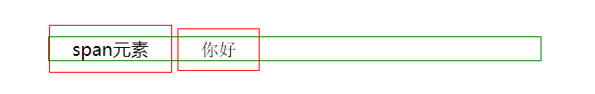

# CSS 知识总结

**CSS 层叠样式表 Cascading Style Sheets**

## CSS 基础

### 层叠

- 样式层叠
- 选择器层叠
- 文件层叠

### 版本

- CSS2.1 使用最广泛的版本
- CSS3 开始分模块升级，不再有整体版本的升级

### CSS 语法

- 语法一

  ```css
  选择器 {
    属性名: 属性值;
    /*注释*/
  }
  ```

  - 注意事项
  - 所有符号都是英文
  - 区分大小写
  - 没有//注释
  - 最后一个分号可以省略，但建议不要省略
  - 任何地方写错了都不会报错，浏览器会忽略

- 语法二
  @ 语法

  ```css
  @charset "UTF-8";
  @import url(2.css);
  @media (min-width: 100px) and (max-width: 200px) {
  语法 1
  }
  ```

  - 注意事项
  - @charset 必须放在第一行
  - 前两个 at 语法必须以分号;结尾
  - charset 是字符集的意思，但 UTF-8 是字符编码 encoding，这是历史遗留问题

### 调试 CSS，代码错误

1.  W3C 验证器：W3C CSS Validation
2.  VScode
3.  WebStorm（错误提示最明确）
4.  Chrome 浏览器，开发者工具

    - 找到对应标签
    - 查看选择器
    - 查看样式是否被划掉
    - 查看样式是否有警告

5.  border 调试法 **重要**
    - 不加 border 不写代码

### 文档查询

- 查资料
  1.  搜索 MDN + 关键词
  2.  关键词 + CSS tricks (英文的)
  3.  关键词 + 张鑫旭 （张鑫旭的博客）
- 查标准
  1.  W3C
  2.  css spec（最新，但太长）
  3.  CSS2.1 中文版（目前有问题优先查这个）
- 查兼容
  1.  caniuse.com
- 查素材
  1.  PSD
      - Freepik 选中 PSD， 搜索 web
      - 如果下载慢，就把域名加到 FQ 插件里
      - 中文免费 PSD 网站较少，需要多搜一下
      - 365PSD 里的 UI 套件还行
  2.  效果图
      - dribbble.com 搜 web（顶级设计师社区）
      - 可以用肉眼模仿它
  3.  商业网站
      - 直接模仿你常去的网站（PC 页面 & 手机页面）

## CSS 文档流 Normal Flow

- 文档流动方向
  - 从左到右：inline 元素，到达最右边才会换行，会断开跨行
  - 从上到下：block 元素，每个另起一行
  - inline-block 也是从左到右，到最右边不会断开跨行
- 宽度
  - inline 宽度为内部 inline 元素的和，不能用 width 指定
  - block 默认自动计算宽度，可用 width 指定，默认 auto，不是 100%（永远不要写 100%）
  - inline-block 结合前两者的特点，可用 width
- 高度
  - inline 高度有 line-height 间接确定，跟 height 无关
  - block 高度有内部文档流元素决定，也可以设置 height
    （有些情况会使元素脱离文档流，比如设置了 absolute）
  - inline-block 跟 block 类似，可以设置 height
- 注意：**不要再 inline 元素里写 block 元素**

- 示例：

```html
<div style="margin: 50px;">
  <span>span元素</span>
  <span style="font-family: 宋体;">你好</span>
</div>
```

```css
div {
  border: 1px solid green;
}
span {
  border: 1px solid red;
  padding: 10px 20px;
}
```



1. padding 撑高的事可视范围，不是实际范围
2. div 包裹住的才是 span 的实际范围

- 下面给 span 加上行高再运行试试

```css
div {
  border: 1px solid green;
}
span {
  border: 1px solid red;
  padding: 10px 20px;
  line-height: 100px;
}
```


3. 所以行高间接 span 的实际高度
4. 除了行高还有字体也影响实际高度

### 特殊情况 溢出

- 溢出 overflow 内容超出了设置的高度/宽度

  - overflow: visible; （放着不管，直接显示）
  - overflow: hidden; （隐藏）
  - overflow: scroll; （超不超过横竖都有滚动条）
  - overflow: auto; （自动，超过就有滚动条，不超过就没有）

- 内联元素，横向只会在第一屏显示:

```html
<div class="box">
  内容内容内容内容内容内容内容内容内容内容内容内容内容内容内容内容内容内容内容内容内容内容内容内容内容内容内容内容内容内容内容内容内容内容内容内容内容内容内容内容内容内容内容内容内容内容内容内容内容内容内容内容内容内容
  内容内容内容内容内容内容内容内容内容内容内容内容内容内容内容内容内容内容内容内容内容内容内容内容内容内容内容内容内容内容内容内容内容内容内容内容内容内容内容内容内容内容内容内容内容内容内容内容内容内容内容内容内容内容
  <div style="border: 1px solid blue; width: 1000px; margin: 0;">你好</div>
  <span style="border: 1px solid red; padding: 0; line-height: 0;"></span>
</div>
```

```css
.box {
  border: 2px solid green;
  height: 200px;
  width: 300px;
  overflow: auto;
}
```


### 脱离文档流（影响高度计算）

1. position: absolute / fixed;
2. float: left / right / both;

## CSS 盒模型

### 盒模型示意图


_图片来自杭州饥人谷教程_

- CSS 盒模型分两种，一种是 content-box，一种是 border-box
- 它们的区别是 content-box 宽高只包含 content
- 而 border-box 宽高包含到 border 具体包括 border,padding,content

- border-box 更好用，更常用

### margin 合并

- margin 之间没有东西会发生合并
- 上下合并，左右不合并
- 第一个和最后一个子元素与父元素的上下 margin 合并
- 父元素与子元素阻止合并：
  1. 父元素加 border/padding
  2. 父元素加 overflow: hidden;
  3. display: flex;

## CSS 布局

- 这里只介绍 flex 和 grid 布局

### flex 布局

1. 概念

   1. 容器 container
   2. 容器内的子元素 items

2. css 写法

   把 container 变成 flex 容器（弹性盒）

   ```css
   .container {
     display: flex;
     /* display: inline-flex; */
   }
   ```

3. container 属性

   1. 改变 items 流动方向（主轴）
      flex-direction:
      row;（横着排）
      column;（竖着排）
      row-reverse;（从右往左排）column-reverse（从下往上）

   2. 是否换行
      flex-wrap:
      wrap;（换行）常用
      nowrap;
      wrap-reverse;（从下往上换行）

   3. 主轴对齐方式（横向）
      justify-content:
      flex-start;（往前靠）
      flex-end;（往后靠）
      center;（居中）
      space-between;（把空间放在中间）（常用）
      space-around;（把空间放到周围）
      space-evenly;（空隙一样大）

   4. 次轴对齐方式（纵向）
      algin-items:
      center;
      flex-start;
      flex-end;
      stretch;（往上下顶，等高，顶满，默认值）

   5. 多行之间对齐（有多余高度空间）
      algin-content:
      flex-start;
      flex-end;
      center;（上下居中）
      stretch;（平均分）
      space-between;（上下顶头，空间在行间）
      space-around;（空间在行两边）

4. flex item 属性

   1. 加 order（排序）
      不写 order 默认是 0
      item 按照 order 的值从小到大排序

   2. 分配多余空间（如何变胖，撑满空间）
      flex-grow 默认是 0，不分配

      ```css
      .item:first-child {
          flex-grow: 1; （长胖比例 1/4=1+2+1）
      }
      .item:nth-child(2) {
          flex-grow: 2; （2/4）
      }
      .item:last-child {
          flex-grow: 1; （1/4）
      }
      ```

   3. 空间不够，原始宽度开始压缩时，如何变瘦
      flex-shrink 默认是 1

      ```css
      .item:first-child {
          flex-shrink: 1;
      }
      .item:nth-child(2) {
          flex-shrink: 0; （值为0不变瘦）
      }
      .item:last-child {
          flex-shrink: 1;
      }
      ```

      - 缩写规则：
        - flex-grow,flex-shrink,flex-basis 可以缩写成：
        - flex: 1 0 100px;
        - 可以只写 1 个 grow，不能只写 2 个值，可以写 3 个值

   4. 控制基准宽度（跟 width 差不多，可代替）
      flex-basis 默认 auto

   5. 控制垂直对齐
      使某个 item 特立独行对齐自己
      align-self: flex-end;(属性取值和 container 里一样)

### grid 布局

- 尤其适合于不规则布局

1. container

   1. grid 盒

   ```css
   .container {
     display: grid;
     /* inline-grid; */
   }
   ```

   2. 划分行和列（具体尺寸划分）

   ```css
   .container {
     grid-template-columns: 40px 50px auto 50px 40px;
     grid-template-rows: 25% 100px auto;
   }
   ```

   
   _图片来自杭州饥人谷教程_

   3. 划分行和列（按份划分 free-space）（适用于平均布局）

   ```css
   .container {
     grid-template-columns: 1fr 2fr 1fr;
     grid-template-rows: 1fr 3fr;
   }
   ```

   4. 间隙

   ```css
   .container {
     grid-gap: 12px;
     /* grid-row-gap */
     /* grid-column-gap */
   }
   ```

2. item

   - 占位（按线，行列分别从那条线到那条线）（但是线看不见的）
     线是可以起名字的，很少用

   ```css
   .item-a {
     grid-row-start: 1;
     grid-row-end: 2;
     /* 纵向占位从第1根线（从外边线开始数）开始到第2根线结束 */
     grid-column-start: 1;
     grid-column-end: 2;
     /* 横向占位从第1根线（从外边线开始数）开始到第2根线结束 */
   }
   ```

## CSS 定位

### position

- 取值：
  1. static（默认值）
  2. relative 可以通过 top/left 设置偏移量
     - 占位不变，只有显示位置改变（现在很少用做位移了）
     - 一般用于给 absolute 做爸爸
     - z-index:越大越在上层，默认 auto（计算值为 0，但不等于 0）可以为负值
  3. absolute 绝对定位
     - 相对于祖先最近的一个定位元素定位的
     - 某些浏览器如果不写 top/left 会位置错乱(0 也写)
     - 善用 left: 100%
     - 善用 left: 50% 和 负 margin
  4. fixed 固定定位 相对于视口定位
     - 也要写 top 和 left（0 也要写）
     - 有特殊情况：
     - 不要把 fixed 放在有 transform 的属性里，会出问题
     - 手机上尽量不要用 fixed，很多坑
  5. sticky 粘滞定位（兼容性特别差，几乎不能用）
     - 能看到的时候再文档流里
     - 滑动快要出去的时候，粘滞到视口边缘

### 层叠上下文


_图片来自杭州饥人谷教程_

1. z-index
   **有 position 才能用**

   1. 正数，越大越在上层
   2. 负数，
      - 当所在元素不是层叠上下文的时候，会逃到 background 下方
      - 当所在元素是层叠上下文，逃不到 background 下方，会出现在 background 上面
   3. 默认 auto，不创建层叠上下文

2. 创建层叠上下文的小世界（死记硬背）

   1. display: flex/inline-flex
   2. opacity 属性值小于 1 的元素
   3. transform 属性值不为 none 的元素
   4. position: fixed
   5. 默认的 html 永远是最底层，包裹所有层
   6. 其他很少用的方法见

## CSS 动画

### 浏览器渲染方式


_图片来自杭州饥人谷教程_
每个属性影响的渲染方式查询
查询网站：https://csstriggers.com

### transform 变形 完整介绍

- 如果面试官问 CSS 动画 怎么优化
  1 答：CSS 优化， left 改成 transform
  2 答：JS 优化，使用 requestAnimationFrame 代替 setTimeout 或 setInterval
  3 答：CSS 优化，使用 will-change

- 查询所有渲染优化的方法：
  [google 文档](https://developers.google.com/web/fundamentals/performance/rendering/stick-to-compositor-only-properties-and-manage-layer-count)

- transform 变形 完整语法 （MDN 写的很全）
  属性及特点：

  1. translateX 横着动
  2. translateY 竖着动
  3. translateZ 视点往四周放射的方向
  4. 缩写 1：transform(X, Y);
  5. 缩写 2：transform3d(X, Y, Z);
  6. XYZ 可以写像素值+px 也可以写 百分数
  7. translate(-50%, -50%);可做绝对定位的居中

  8. scale(1.5); 放大 1.5 倍，也会改变 border 宽度（不常用）
  9. 支持 scaleX（横向）scaleY（纵向）

  10. rotate(45deg); 顺时针旋转 45 度
  11. rotateX(45deg); 围绕 X 轴旋转 45 度，
      加 X，Y，Z 指定旋转轴（默认垂直于屏幕 Z 轴）
  12. rotate3d(); 在 3d 方向转动，太复杂
  13. 用到的时候查 rotate MDN 文档

  14. skewX(15deg); 倾斜 15 度， X Y 指定中心轴，没有 Z

  15. 以上 4 种属性可同时使用，中间用空格隔开
      transform: translate() scale() rotate() skew();

### transition 过渡

- 作用：添加中间帧
- 基本用法

  1. 语法 transition: 属性名 时长 过渡方式 延迟;
  2. 可以用逗号分隔两个不同属性
     transition: left 200ms, top 500ms;
  3. 属性名，可以写具体的也可以写 all
  4. 时长，过渡时间，秒 s/毫秒 ms
  5. 过渡方式：linear 匀速|ease 缓动|ease-in 淡入|ease-out 淡出|ease-in-out 淡入淡出|其他方式可查 [MDN](https://developer.mozilla.org/zh-CN/docs/Web/CSS/timing-function)
  6. 延迟：过多久开始动画，秒/毫秒

- 注意，不是左右属性都能过渡
  1. display: none=>block 没法过渡
     一般改用 visibility: visible=>hidden
  2. 颜色是可以过渡的，比如 background
  3. 透明度是可以过渡的，opacity

### 实现三维视图，设置视点（XYZ 轴原点）

父元素上加 CSS 属性，设定视点

```css
.wrapper {
  perspective: 1000px;
  border: 1px solid black;
}
```

### 两次动画实现方法

1. 两次 transform
   .a=>transform=>.b
   .b=>transform=>.c

   - 如何知道中间点呢？
     用 setTimeout 或者监听 transitionend 事件
     注意第三个状态要包含第二个状态

2. 使用 animation

   - 声明关键帧 @keyframes
   - 添加动画

   ```css
   .demo.start {
     animation: xxx 1.5s forwards;
   }
   /* forwards停止不返回 */
   @keyframes xxx {
     0% {
       transform: none;
     }
     66.66% {
       transform: translateX(200px);
     }
     100% {
       transform: translateX(200px) translateY(100px);
     }
   }
   ```

- @keyframes 完整语法
  

  1. 搜索 keyframes MDN 讲得很清楚
  2. 一种写法是 from to
  3. 另一种写法是百分数

- animation 完整语法
  - animation: 时长|过渡方式|延迟|次数|方向|填充模式|是否暂停|动画名;
  1. 时长：秒/毫秒
  2. 过渡方式：跟 transition 取值一样
  3. 次数：3 或者 2.4 或者 infinite（无限次）
  4. 方向：
     1. reverse 反过来
     2. alternate 交替的，先去再返回
     3. alternate-reverse 先回再去
  5. 填充模式：none|forwards（停在最后）|backwards|both
  6. 是否暂停：paused|running
  7. 以上属性都有单独的名字，详见 MDN 文档
     在只改一个值时单独使用

### 练习：跳动的红心

1. [transition](http://js.jirengu.com/wuyubedimo/5/edit?html,css,output)

2. [animation](http://js.jirengu.com/kezududete/4/edit?html,css,output)
